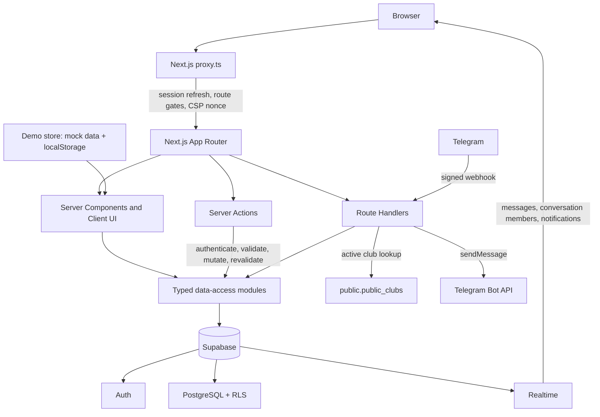

# QAIRU Hub Community

> The community platform for QAIRU students, intended for **[community.qairuhub.com](https://community.qairuhub.com)**.

QAIRU Hub brings student profiles, communities, projects, events, campus posts, shared resources, direct messages, notifications, and university clubs into one product. It is an independent student platform built around QAIRU's campus community.

The repository contains two application modes:

- **Live mode** uses Supabase Auth, PostgreSQL, Row Level Security, RPCs, and Realtime.
- **Demo mode** uses typed mock data and browser `localStorage` for interactive product exploration.

The clubs and Telegram integration is currently an additive prototype backed by real Supabase records. It does not substitute fictional club data when the backend is unavailable.

## Purpose

The project is designed to give QAIRU students one place to:

- discover people by program, skills, and interests;
- form communities and participate in campus life;
- publish projects, recruit contributors, and review applications;
- create and attend events;
- share useful external resources;
- post updates and discuss student work;
- communicate through direct messages and activity notifications;
- discover active university clubs and continue the conversation in Telegram.

## Implemented features

### Identity and profiles

- Email/password sign-up and sign-in through Supabase Auth.
- Email confirmation, password recovery, and session-aware redirects.
- Required onboarding with username, name, program, academic year, skills, and interests.
- Campus-visible or private profiles, collaboration availability, and editable profile settings.
- Student directory with search and filters for program, skill, and interest.
- Follow/unfollow and direct-message entry points from student profiles.

### Community and campus activity

- Home feed for campus-wide and community posts.
- Post creation, likes, private bookmarks, comments, and deletion of a user's own comments.
- Community creation, membership, member counts, community detail pages, and community feeds.
- Project creation with technologies and open roles.
- Project applications, owner accept/reject workflow, derived team membership, and private saves.
- Event creation, capacity enforcement, attendance, private saves, and share actions.
- External resource publishing, search/filtering, detail pages, and private saves.

### Messaging and notifications

- One-to-one conversations with paginated message history.
- Realtime message delivery and unread state.
- Realtime notifications for follows, post likes/comments, and project application activity.
- Individual and bulk notification read actions.
- Reconciliation after tab visibility changes and Realtime channel cleanup on logout.

### University clubs and Telegram prototype

- Public, searchable directory of active clubs at `/clubs`.
- Public club detail pages with active-only visibility.
- Authenticated club creation and owner/moderator editing.
- Atomic club and Telegram-setting updates through Supabase RPCs.
- Telegram deep links with stable opaque club keys.
- Secret-protected `POST /api/telegram/webhook` endpoint.
- Bot responses generated from the same `public.public_clubs` view used by the website.
- Validation for Telegram links, bot usernames, chat IDs, payload size, and webhook rate limits.

### Product experience and security

- Responsive desktop/mobile application shell.
- Light, dark, and system themes.
- Explicit loading, empty, not-found, and error states.
- Supabase SSR cookie sessions and server-side access gates.
- Row Level Security on all exposed product tables, narrow column grants, and database-enforced write quotas.
- Per-request nonce Content Security Policy plus HSTS and baseline security headers in production.
- Same-origin redirect validation and a server-side admin-role gate.

## Known non-features

The following are intentionally **not** presented as complete:

- `Opportunities` is a placeholder in live mode; the current database schema has no live opportunities table.
- `/admin` has an active role gate, but no operational dashboard or moderation workflow.
- Product file uploads are disabled. Resources use external HTTP(S) URLs, and club logos use trusted hosted HTTPS origins.
- Project repository links are not connected.
- The Telegram prototype does not create groups, verify bot administrator rights, link Telegram identities to QAIRU accounts, or synchronize memberships.
- The Telegram webhook rate limiter is in-memory per server instance and is not a distributed production-wide control.

## Tech stack

| Layer | Technology |
| --- | --- |
| Runtime | Node.js 24 |
| Web framework | Next.js 16.3 App Router and React 19.2 |
| Language | TypeScript 5 with strict type checking |
| Styling | Tailwind CSS 4 |
| UI | shadcn configuration, Radix UI, Lucide React, Sonner |
| Theme | `next-themes` |
| Backend | Supabase Auth, PostgreSQL, Data API, Realtime |
| Supabase clients | `@supabase/supabase-js` 2.112.3 and `@supabase/ssr` 0.12.4 |
| Bot integration | Telegram Bot API over a Next.js Route Handler webhook |
| Quality | ESLint 9, Node.js test runner, pgTAP database regression tests |

Exact dependency versions are recorded in `package.json` and `package-lock.json`.

## Architecture



### Request and data flow

1. `proxy.ts` attaches a per-request CSP nonce, refreshes Supabase SSR cookies, and enforces authentication/onboarding gates in live mode.
2. App Router pages are predominantly Server Components. They read through typed modules in `lib/data/` and `lib/clubs/`.
3. Client interactions call authenticated Server Actions in `app/actions/`. Actions validate untrusted input, call the data layer, and revalidate affected routes.
4. PostgreSQL constraints, grants, RLS policies, triggers, and narrow RPCs are the final authorization and integrity boundary.
5. Browser clients subscribe only to `messages`, `conversation_members`, and `notifications` for Realtime updates.
6. The Telegram webhook authenticates with its own secret, reads only the public active-club projection, and sends plain-text responses through the Bot API.

The root layout is deliberately dynamic so every response can carry a fresh script nonce.

### Data model by domain

| Domain | Main database objects |
| --- | --- |
| Identity | `profiles`, `programs`, `skills`, `interests`, `profile_skills`, `profile_interests`, `user_roles` |
| Social graph | `follows`, `communities`, `community_members` |
| Projects | `projects`, `project_technologies`, `project_roles`, `project_members`, `project_applications`, `project_saves` |
| Events | `events`, `event_attendees`, `event_saves` |
| Content | `posts`, `comments`, `post_likes`, `post_bookmarks`, `resources`, `resource_saves` |
| Activity | `conversations`, `conversation_members`, `messages`, `notifications` |
| Clubs | `communities`, `club_telegram_integrations`, `club_telegram_connections`, `public_clubs` view |

## Project structure

```text
app/
├── (auth)/                 Authentication pages
├── (hub)/                  Protected community application routes
├── actions/                Authenticated Server Actions and validation boundaries
├── api/                    Comments API and Telegram webhook
├── auth/                   Supabase callback and recovery Route Handlers
├── clubs/                  Public directory and protected club management
├── admin/                  Server-gated admin placeholder
├── layout.tsx              Dynamic root layout, metadata, and providers
└── page.tsx                Public landing page

components/
├── activity/               Realtime unread-count provider
├── auth/                   Auth forms and onboarding
├── clubs/                  Club directory, detail, logo, and form UI
├── demo/                   Interactive demo-only screens and dialogs
├── layout/                 Application shell and navigation
├── messages/               Live direct messaging UI
├── notifications/          Live notification UI
├── people/                 Directories, profiles, and settings
├── posts/                  Live feed and discussion UI
├── resources/              Live resource UI
├── social/                 Communities, projects, events, and follow UI
└── ui/                     Shared UI primitives

lib/
├── auth/                   Auth client service, current user, routes, and policies
├── clubs/                  Club data access, parsing, and validation
├── data/                   Supabase queries and typed live-domain models
├── demo/                   localStorage-backed demo state
├── security/               Trusted origins and safe redirects
├── supabase/               Browser, server, anonymous, and proxy clients
└── telegram/               Bot behavior, validation, API client, and rate limiting

supabase/
├── migrations/             Forward-only PostgreSQL schema history
├── tests/database/         Transactional pgTAP authorization regressions
├── config.toml             Local Supabase/Auth configuration
└── seed.sql                Reference data and conditional demo fixtures

scripts/                    CSP compatibility patch and header verification
types/                      App models and generated Supabase database types
docs/                       Security audit, preview checklist, and clubs prototype notes
public/                     Static assets and Open Graph image
proxy.ts                    Session, access-control, and response-security boundary
```

## Local development

### Prerequisites

- Node.js **24.x**
- npm
- Docker Desktop and the Supabase CLI for live-mode development

### Demo mode

The Hub defaults to demo mode when `NEXT_PUBLIC_APP_MODE` is absent or is not exactly `live`.

```bash
npm ci
npm run dev
```

Open <http://localhost:3000>. Demo interactions are stored in the current browser's `localStorage`.

The club directory is an exception: it always reads real Supabase club records, so `/clubs` requires the Supabase URL and publishable key even while the rest of the Hub runs in demo mode.

### Live mode with local Supabase

1. Start the local stack and apply all migrations and seed data:

   ```bash
   npx supabase start
   npx supabase db reset
   npx supabase status
   ```

2. Copy `.env.example` to `.env.local` and replace the Supabase URL/key with the local values reported by `supabase status`.

3. Set `NEXT_PUBLIC_APP_MODE=live`.

4. Use one exact origin for all three of the following:

   - `NEXT_PUBLIC_SITE_URL`;
   - `[auth].site_url` and `additional_redirect_urls` in `supabase/config.toml`;
   - the port/hostname used to open the Next.js app.

   The checked-in `.env.example` uses `http://localhost:3010`, while the current local Supabase Auth config uses `http://127.0.0.1:3000`. Align them before testing confirmation and recovery links. To keep the example origin, run:

   ```bash
   npm run dev -- -p 3010
   ```

5. Open the matching origin and create an account. Local confirmation and recovery emails are available in Supabase's local mail UI at <http://localhost:54324>.

### Telegram webhook development

Telegram requires a public HTTPS webhook. Use an isolated preview deployment or a trusted HTTPS tunnel, then configure the webhook URL as:

```text
https://<public-origin>/api/telegram/webhook
```

The BotFather token and webhook secret must remain server-only. See `docs/university-clubs-telegram-prototype.md` for the setup and club handoff flow.

## Environment variables

| Variable | Visibility | Required | Purpose |
| --- | --- | --- | --- |
| `NEXT_PUBLIC_SUPABASE_URL` | Public | Live mode and all club routes | Supabase project/API URL; also added to CSP image and connection sources. |
| `NEXT_PUBLIC_SUPABASE_PUBLISHABLE_KEY` | Public | Live mode and all club routes | Supabase publishable client key. Never use a service-role key here. |
| `NEXT_PUBLIC_SITE_URL` | Public | Live mode and production | Exact application origin, without a path, query, or fragment. HTTPS is required outside local development. Production target: `https://community.qairuhub.com`. |
| `NEXT_PUBLIC_APP_MODE` | Public | No | `live` enables Supabase-backed application flows; every other value falls back to `demo`. |
| `TELEGRAM_BOT_TOKEN` | Server-only | Telegram webhook | BotFather API token used to call `sendMessage`. |
| `TELEGRAM_BOT_USERNAME` | Server-only | Telegram deep links | Public bot username, accepted with or without `@`. |
| `TELEGRAM_WEBHOOK_SECRET` | Server-only | Telegram webhook | 16–256 character webhook secret using letters, digits, `_`, or `-`. |

Example:

```dotenv
NEXT_PUBLIC_SUPABASE_URL=https://your-project.supabase.co
NEXT_PUBLIC_SUPABASE_PUBLISHABLE_KEY=sb_publishable_your_key
NEXT_PUBLIC_SITE_URL=https://community.qairuhub.com
NEXT_PUBLIC_APP_MODE=live

TELEGRAM_BOT_TOKEN=
TELEGRAM_BOT_USERNAME=
TELEGRAM_WEBHOOK_SECRET=
```

Only the Supabase publishable key belongs in browser-visible configuration. No service-role credential is required by this application.

## Verification

```bash
npm test
npm run typecheck
npm run lint
npm run build
pwsh -File scripts/verify-security-headers.ps1
```

`npm test` currently runs the security, club parsing/validation, Telegram bot, and webhook-boundary suites. Database authorization tests live in `supabase/tests/database/`; they are transactional and must be run only against a local stack or an explicitly selected development project with the expected fixture accounts.

## Current status

As of **2026-09-07**:

| Area | Status |
| --- | --- |
| Core community UI | Implemented in interactive demo and Supabase-backed live modes |
| Authentication and onboarding | Implemented; hosted email/Auth settings still require environment-specific verification |
| Profiles, follows, communities, projects, events, posts, resources | Implemented in live mode |
| Direct messaging and notifications | Implemented with Supabase Realtime; a final two-browser acceptance test remains a launch task |
| University clubs | Real-data web and database prototype implemented |
| Telegram handoff | Webhook, bot logic, and deep links implemented; real BotFather/group/public-HTTPS E2E testing remains |
| Opportunities | Demo-only illustrative experience; live mode is a deliberate placeholder |
| Admin | Server-side role gate implemented; operational tools are not implemented |
| File uploads | Intentionally disabled pending a private Storage design and policies |
| Launch readiness | Repository audit records approval for a protected preview/small controlled beta, not an unrestricted public launch |

Current local verification:

- `npm test`: **49 passed, 0 failed**;
- `npm run typecheck`: passed;
- `npm run lint`: passed;
- `npm run build`: passed with Next.js 16.3.0.

The current test run does not replace the environment-specific pgTAP, hosted Auth, SMTP, Realtime browser, webhook, DNS, or production deployment checks.

## Roadmap

The roadmap below is derived from the repository's placeholders, security gate, and clubs prototype documentation.

### Production domain and controlled launch

- Deploy and configure `community.qairuhub.com` with separate preview and production environments.
- Set the exact Supabase Auth Site URL and callback allowlist for the production domain.
- Enable leaked-password protection and verify the hosted password/session policy.
- Configure production SMTP and test confirmation and password-recovery delivery.
- Complete the two-account/two-browser Realtime acceptance flow.
- Add operational monitoring for Auth, database, Realtime, and email failures.

### Open-beta product controls

- Implement reporting, moderation, and an abuse-response workflow.
- Replace the admin placeholder with real operational tooling.
- Define retention and account-deletion behavior for users who own communities, projects, or events.
- Add privacy/terms copy and complete backup/restore drills.
- Add Auth CAPTCHA when traffic or abuse signals require it.

### Product completion

- Add a trusted publishing workflow and real data model for Opportunities.
- Add project repository links.
- Design private Supabase Storage uploads with ownership, MIME/size allowlists, signed reads, cleanup, moderation, and cross-account policy tests.

### Clubs and Telegram

- Verify bot membership/admin rights and record verification state.
- Create or revoke invite links only after explicit group-admin authorization.
- Add consent-based Telegram-to-QAIRU identity linking and membership synchronization.
- Add announcements, event reminders, moderation commands, and audit logs.
- Add an official club verification/approval workflow.
- Replace per-instance webhook throttling with durable distributed rate limiting and update replay deduplication.
- Add managed club-logo upload through a dedicated private Storage design.

## Security and supporting documentation

- [`SECURITY.md`](SECURITY.md) — enforced trust boundaries and launch controls.
- [`docs/security-audit-phase-3.md`](docs/security-audit-phase-3.md) — protected-preview security review and evidence.
- [`docs/phase-4-preview-tester-checklist.md`](docs/phase-4-preview-tester-checklist.md) — manual product and Realtime acceptance checklist.
- [`docs/university-clubs-telegram-prototype.md`](docs/university-clubs-telegram-prototype.md) — database, website, bot, setup, and prototype limitations.
