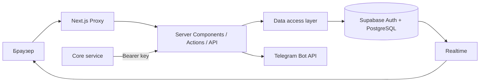

# QAIRU HUB — Техническая документация и текущее состояние проекта

## 1. Обзор проекта

QAIRU HUB — веб-платформа сообщества студентов QAIRU. Она объединяет профили участников, поиск людей и проектных ролей, сообщества, студенческие клубы, проекты, события, публикации, ресурсы, личные сообщения и уведомления.

Текущая версия предназначена для контролируемого preview или небольшой закрытой беты. Основные авторизованные сценарии реализованы на Next.js и Supabase, однако продукт еще не готов к неограниченному публичному запуску: отсутствуют проверка статуса студента, пользовательские жалобы и инструменты модерации, справочные и юридические страницы, а часть управленческих сценариев остается неполной.

Приложение имеет два режима. В `live` используются Supabase Auth, PostgreSQL, RLS, RPC и Realtime. В `demo` большая часть Hub-интерфейса работает на демонстрационных данных и `localStorage`. Каталог клубов является исключением: публичные страницы клубов читают реальные данные Supabase в обоих режимах, а создание и редактирование клубов всегда требуют реальной авторизации.

## 2. Технологический стек

| Компонент | Технология | Назначение |
|---|---|---|
| Frontend и backend | Next.js 16.3 App Router, React 19, TypeScript 5 | Страницы, Server Components, Server Actions и Route Handlers |
| UI | Tailwind CSS 4, Radix UI, shadcn-конфигурация, Lucide, Sonner | Стили, компоненты, иконки и уведомления интерфейса |
| Авторизация | Supabase Auth, `@supabase/ssr` | Регистрация, сессии, подтверждение email и восстановление пароля |
| База данных | Supabase PostgreSQL 17 | Основные сущности, связи, ограничения, триггеры и RPC |
| Контроль доступа | PostgreSQL RLS и column-level grants | Изоляция пользовательских и служебных данных |
| Обновления в реальном времени | Supabase Realtime | Сообщения и счетчики непрочитанных уведомлений |
| Интеграции | Telegram Bot API | Переход из каталога клуба в Telegram через webhook/deep link |
| Развертывание | Vercel | Хостинг Next.js-приложения |
| Наблюдаемость | Vercel Speed Insights, Server-Timing | Метрики скорости и серверные временные показатели |
| Тестирование | Node.js test runner, pgTAP | Проверка логики, безопасности, RLS и RPC |

## 3. Текущий статус функциональности

| Модуль | Статус | Что реализовано | Что осталось |
|---|---|---|---|
| Authentication | ✅ Готово | Регистрация и вход по email/паролю, выход, защита маршрутов | Проверить production-настройки Auth и реальную доставку писем |
| Email verification | ✅ Готово | PKCE callback, экран подтверждения и безопасные внутренние redirect-пути | Production SMTP и allowlist redirect-адресов не подтверждены |
| Onboarding | ✅ Готово | Пятишаговый сценарий первого курса, направления, роль, интересы и предпочтения; атомарный RPC | Настройки профиля пока не редактируют новые onboarding-поля |
| Profiles | 🟡 Частично | Просмотр и изменение основных полей, навыков, интересов, видимости и доступности | Нет загрузки аватара, соцсетей, языков, часов в неделю и удаления аккаунта |
| People | ✅ Готово | Каталог видимых профилей, фильтры, профиль пользователя, follow/unfollow и переход к сообщению | Нет ранжирования рекомендаций и расширенных privacy/blocking-настроек |
| Communities | 🟡 Частично | Создание, каталог, поиск, вступление/выход, участники и публикации | Нет полноценного UI редактирования и модерации сообщества |
| Clubs | 🟡 Частично | Публичный каталог и карточки активных клубов на общей модели `communities` | Подсистема остается прототипом; нет полноценного жизненного цикла и модерации |
| Club creation | ✅ Готово | Авторизованное создание клуба и Telegram-данных через транзакционный RPC | Нет управляемой загрузки логотипа и проверки прав бота |
| Club management | 🟡 Частично | Редактирование владельцем или модератором | Нет административной очереди, аудита действий и расширенного управления участниками |
| Projects | 🟡 Частично | Создание с технологиями и открытыми ролями, каталог, карточка, команда и сохранение | Нет UI редактирования проекта, ролей и истории обновлений |
| Project roles | 🟡 Частично | Роли создаются вместе с проектом и отображаются в Team Finder | Нет отдельного интерфейса управления и закрытия ролей |
| Project applications | 🟡 Частично | Подача заявки, accept/reject владельцем, автоматическое добавление участника | Нет причины отказа и UI отзыва заявки |
| Team Finder | ✅ Готово | Поиск открытых ролей и людей с фильтрами, учет текущего статуса заявки | Нет автоматического рейтинга или рекомендательного matching |
| Events | 🟡 Частично | Создание, поиск, просмотр, участие/отмена и сохранение; контроль вместимости в БД | Нет редактирования, waitlist, напоминаний, check-in и итогов события |
| Notifications | ✅ Готово | In-app уведомления о follow, реакциях, комментариях и заявках; read/unread и Realtime | Нет email/Telegram-доставки и пользовательских настроек каналов |
| Telegram integration | 🟡 Частично | Секрет webhook, deep links клуба, актуальные кнопки клуба и базовый rate limit | Нет связи профиля с Telegram, проверки членства/админа и распределенного rate limit |
| Activity/social features | 🟡 Частично | Лента постов, публикации, комментарии, likes, bookmarks, follows и share-ссылка | Нет автоматической activity timeline по изменениям проектов и событий |
| Search/filtering | 🟡 Частично | Фильтры каталогов и Team Finder | Глобальная команда только открывает разделы; поиск ограничен уже загруженной выборкой |
| Moderation/reporting | ⚪ Не реализовано | Существует только базовая роль администратора | Нет жалоб, очереди, решений, блокировок и журнала действий |
| Help | ⚪ Не реализовано | Внутренняя техническая документация существует | Нет пользовательских `/help`, правил, privacy и terms страниц |
| Core/internal API | ✅ Готово | Bearer-защищенные GET/POST/PATCH для users, events, communities и projects | Нет DELETE, создания Auth-пользователей и части новых полей профиля |
| Analytics | ⚪ Не реализовано | Пакет `@vercel/analytics` установлен | Компонент Analytics не подключен, поэтому наличие пакета не означает сбор аналитики |
| Speed Insights | ✅ Готово | Глобально подключен компонент Vercel Speed Insights | Фактические production-данные требуют проверки в Vercel |
| Admin/internal functionality | 🟡 Частично | Проверка роли `admin` и закрытый маршрут `/admin` | Страница является placeholder; операционных инструментов нет |

## 4. Основные пользовательские сценарии

### Авторизация

**Статус:** реализовано.
**Шаги:** регистрация по email и паролю → переход по ссылке подтверждения → обмен PKCE-кода на сессию → onboarding или `/home`. Для восстановления: запрос письма → recovery callback → установка нового пароля → повторный вход.
**Известное ограничение:** код не проверяет принадлежность email университету; production-доставка писем не подтверждена.

### Onboarding

**Статус:** реализовано.
**Шаги:** пользователь указывает основные данные → выбирает направление Machine Learning или Physical AI → совместимую роль → 1–5 проектных интересов → 1–5 предпочтений вклада. RPC `complete_my_onboarding` атомарно сохраняет профиль и связи.
**Известное ограничение:** новые поля нельзя изменить на странице настроек.

### Профили и поиск людей

**Статус:** частично реализовано.
**Шаги:** пользователь открывает `/people` или people-режим `/find` → применяет фильтры → открывает `/u/[username]` → подписывается или начинает диалог.
**Известное ограничение:** отсутствуют загрузка аватара, блокировки и автоматические рекомендации.

### Студенческие клубы

**Статус:** частично реализовано как прототип.
**Шаги:** анонимный посетитель открывает `/clubs` → фильтрует активные клубы → переходит в карточку → открывает Telegram-ссылку. Авторизованный организатор может создать клуб и затем редактировать его данные.
**Известное ограничение:** нет проверки статуса бота, модерации и управляемого файлового хранилища.

### Проекты и заявки

**Статус:** частично реализовано.
**Шаги:** пользователь создает проект с технологиями и ролями → кандидат находит открытую роль → отправляет заявку → владелец принимает или отклоняет ее → при принятии триггер добавляет кандидата в команду.
**Известное ограничение:** отсутствуют управление ролями, редактирование проекта, причина отказа и UI отзыва заявки.

### События

**Статус:** частично реализовано.
**Шаги:** пользователь создает или находит событие → открывает карточку → отмечает участие или отменяет его → при необходимости сохраняет событие. Вместимость защищена транзакционной логикой БД.
**Известное ограничение:** отсутствуют редактирование, waitlist, напоминания и check-in.

### Уведомления

**Статус:** реализовано для in-app канала.
**Шаги:** действия пользователей и решения по заявкам создают уведомления через триггеры → получатель видит Realtime-счетчик и список → отмечает одну или все записи прочитанными.
**Известное ограничение:** нет email/Telegram-доставки и настроек каналов.

## 5. Страницы и маршруты

В репозитории подтвержден 41 filesystem-паттерн страниц и Route Handlers. Ниже перечислены значимые пользовательские маршруты без полного технического списка API.

| Маршрут | Назначение | Доступ | Статус |
|---|---|---|---|
| `/` | Публичная главная страница | Публичный | ✅ Готово |
| `/login`, `/sign-in`, `/sign-up` | Вход и регистрация | Для неавторизованных | ✅ Готово |
| `/verify-email`, `/forgot-password`, `/reset-password` | Подтверждение и восстановление | Публичный или recovery-сессия | ✅ Готово |
| `/onboarding` | Первичная настройка профиля | Авторизованный, не завершивший onboarding | ✅ Готово |
| `/home` | Dashboard и социальная лента | Авторизованный + onboarding | ✅ Готово |
| `/find` | Team Finder: проекты и люди | Авторизованный + onboarding | ✅ Готово |
| `/people`, `/u/[username]` | Каталог и профиль участника | Авторизованный + onboarding | ✅ Готово |
| `/settings` | Настройки профиля | Авторизованный + onboarding | 🟡 Частично |
| `/communities`, `/communities/[slug]` | Сообщества, участники и публикации | Авторизованный + onboarding | 🟡 Частично |
| `/projects`, `/projects/[slug]` | Проекты, роли, команды и заявки | Авторизованный + onboarding | 🟡 Частично |
| `/events`, `/events/[slug]` | Каталог и карточки событий | Авторизованный + onboarding | 🟡 Частично |
| `/resources`, `/resources/[id]` | Внешние образовательные ресурсы | Авторизованный + onboarding | 🟡 Частично |
| `/messages` | Личные диалоги | Авторизованный + onboarding | ✅ Готово |
| `/notifications` | Центр уведомлений | Авторизованный + onboarding | ✅ Готово |
| `/clubs`, `/clubs/[slug]` | Публичный каталог клубов | Публичный | 🟡 Прототип |
| `/clubs/new`, `/clubs/[slug]/edit` | Создание и управление клубом | Авторизованный + права владельца/модератора | 🟡 Прототип |
| `/opportunities` | Будущий каталог возможностей | Авторизованный + onboarding | ⚪ Placeholder |
| `/admin` | Будущая внутренняя панель | Роль `admin` | ⚪ Placeholder |

## 6. Архитектура

QAIRU HUB — единое Next.js App Router приложение:

- `src/app` содержит страницы, layouts, Server Actions и Route Handlers;
- `src/components` содержит AppShell, навигацию, формы и feature-компоненты;
- `src/lib` содержит auth, data access, Supabase-клиенты, validation, demo-данные, Core API и Telegram;
- `src/types` содержит общие и сгенерированные типы базы данных.

Server Components выполняют аутентификацию, серверные запросы и подготовку сериализуемых моделей. Client Components отвечают за формы, фильтрацию, диалоги, optimistic UI, тему, demo-state и Realtime-подписки. `src/proxy.ts` обновляет сессию, классифицирует защищенные маршруты, формирует CSP nonce и передает только проверенные внутренние identity headers.

Обычные операции используют публичный Supabase key, пользовательскую сессию и RLS. Многошаговые изменения выполняются через Server Actions и транзакционные RPC. Core API использует отдельный server-only привилегированный клиент после собственной Bearer-проверки.



## 7. База данных и Supabase

В exposed-схеме `public` определена 31 таблица; на всех 31 включен RLS. Основные группы данных: профили и справочники, social graph, сообщества, проекты и заявки, события, контент и ресурсы, сообщения и уведомления, клубы и Telegram. В приватной схеме `app_private` находится таблица счетчиков write-rate-limit.

Три представления используют `security_invoker = true`: `post_feed_items`, `resource_items` и `public_clubs`. Поэтому они сохраняют политики нижележащих таблиц. Значимые RPC включают `complete_my_onboarding`, `save_my_profile`, `create_project`, функции прямых диалогов и сообщений, а также `create_university_club` и `update_university_club`.

История состоит из 14 миграций. Read-only проверка от 9 сентября 2026 года подтвердила точное совпадение локальной и удаленной истории, включая последнюю onboarding-миграцию. Цепочка миграций от 4 сентября является канонической базовой линией. Примененные файлы нельзя переименовывать, переписывать или объединять. Все изменения схемы должны выпускаться только новыми forward-only миграциями.

## 8. Авторизация и безопасность

### Подтверждено

- Supabase Auth обеспечивает email/password регистрацию, сессии, PKCE callback и recovery flow.
- Proxy, страницы, Server Actions и Route Handlers повторно проверяют необходимый уровень доступа.
- RLS включен на всех 31 публичных таблицах; ownership-политики ограничивают профили, заявки, сообщения, сохранения и уведомления.
- Анонимный Data API не имеет доступа к campus-профилям и контенту. Намеренное исключение — узкое представление активных публичных клубов.
- Column-level grants не позволяют клиенту назначать служебные идентификаторы, timestamps, владельцев, отправителей сообщений и закрытые notification-поля.
- RPC имеют ограниченные права; транзакционные функции проверяют `auth.uid()` и предметные ограничения.
- Core API требует точного Bearer-токена длиной не менее 32 символов, ограничивает JSON 64 КиБ, использует allowlists и явные response projections. После проверки он работает привилегированным ключом и обходит RLS, поэтому секреты должны оставаться только на сервере.
- CSP nonce, HSTS в production и дополнительные security headers задаются приложением.
- Unit- и pgTAP-тесты покрывают redirect validation, RLS, cross-account isolation, ограничения полей, квоты, вместимость событий, сообщения и Core API.

### Требует production-проверки

Не подтверждены актуальные настройки leaked-password protection, SMTP, CAPTCHA, Auth redirect allowlists, резервное копирование, алерты, текущий Supabase Advisor и поведение двух реальных браузерных сессий Realtime. Также нет университетской верификации, модерации, правил хранения данных и удаления аккаунта.

## 9. Тестирование

Команда `npm test` повторно выполнена во время подготовки исходного комплекта документации: **71 тест пройден, 0 ошибок**. Проверены security/auth helpers, клубы и Telegram, Team Finder, Core API и onboarding validation.

В `supabase/tests/database` находятся пять pgTAP-наборов с 84 запланированными assertions: clubs, Core ownership, onboarding, security regression и Team Finder. Их содержимое проверено, но они не запускались, поскольку локальный Docker/Supabase stack был недоступен. `git diff --check` прошел без ошибок. `lint`, `typecheck` и `build` в рамках documentation-only изменения не запускались.

## 10. Deployment

Основной подтвержденный поток:

```text
GitHub → master → Vercel → Next.js → Supabase
```

`master` является production-веткой. Репозиторий содержит `vercel.json`, но внешняя Git-интеграция Vercel и правила promotion не хранятся в коде. Перед deployment необходимо выполнить тесты, lint, typecheck, build, локальные pgTAP-тесты, сверить linked migration history и проверить dry run. Миграции применяются до кода, который от них зависит, и только вперед.

После deployment необходимо проверить анонимные страницы, signup/recovery, onboarding, профили, Team Finder, заявки, события, сообщения и уведомления двумя аккаунтами, отказ неавторизованного доступа, Core API, Telegram webhook, security headers и runtime/database logs.

## 11. Известные ограничения

| Ограничение | Влияние | Статус / следующий шаг |
|---|---|---|
| Нет проверки студента QAIRU | Любой разрешенный Supabase Auth email может зарегистрироваться | Добавить verified-student состояние и enforcement в приложении/RLS |
| Нет moderation/reporting | Пользователи не могут жаловаться, сотрудники — фиксировать решения | Создать reports, очередь, действия и audit log |
| Неполные profile/project/community/event lifecycle | Владельцы не могут выполнить ряд операций управления | Добавить UI, Server Actions, RLS и тесты для существующих пробелов |
| `/opportunities` и `/admin` — placeholders | Нет рабочего каталога возможностей и панели операций | Реализовывать только после утверждения схемы и модели прав |
| Глобальный поиск не ищет сущности | Command palette только навигирует, фильтры работают по ограниченной выборке | Добавить permission-aware серверный поиск |
| Telegram остается прототипом | Нет связи аккаунта, проверки членства и надежного общего rate limit | Добавить identity/consent model и shared rate limiting |
| Upload отключен | Нет файлов ресурсов, вложений сообщений и managed-логотипов | Спроектировать Storage policies, лимиты и cleanup |
| Нет privacy/help/legal страниц | Пользовательские правила и каналы поддержки не представлены | Добавить согласованные страницы и процесс обращений |
| Нет browser E2E | Внешние и многопользовательские сценарии проверяются вручную | Добавить изолированный E2E-контур |
| Local Auth origins расходятся | Redirect может сломаться между портами 3000 и 3010 | Унифицировать config, env и команду запуска |
| Web Analytics не подключен | Установленный пакет не дает фактической аналитики | Подключить одобренный компонент или удалить зависимость |

## 12. Что не удалось подтвердить

- текущий production DNS/domain и TLS;
- внешнюю Git-интеграцию Vercel и deployed environment variables;
- hosted-настройки Supabase Auth, SMTP, CAPTCHA и backups;
- актуальные предупреждения Supabase Advisor;
- production-доставку email;
- production-поведение Realtime и Telegram;
- доступность интерфейса для пользователей с ограниченными возможностями;
- полный production browser E2E.

## 13. Приоритеты дальнейшей разработки

### P0 — блокирует основной продукт

- Ввести подтвержденный статус студента и обеспечить его на уровне приложения и RLS.
- Реализовать жалобы, модерацию, журнал решений и рабочую административную панель.
- Добавить пользовательские правила, privacy/terms и канал поддержки.
- Подтвердить production Auth, SMTP, redirects, DNS/TLS, secrets, backups и Advisor.

### P1 — важно для MVP

- Завершить редактирование профилей, проектов, ролей, сообществ и событий.
- Добавить отзыв заявки, причины решений и недостающие lifecycle-действия.
- Внедрить browser E2E для Auth, onboarding и ключевых двухаккаунтных сценариев.
- Устранить расхождение локальных Auth origins и запускать pgTAP в обязательном pre-deploy процессе.
- Усилить Telegram shared rate limit либо четко оставить интеграцию ограниченным handoff-прототипом.

### P2 — улучшения

- Добавить permission-aware глобальный поиск и, при необходимости, ранжирование Team Finder.
- Спроектировать безопасные uploads/attachments через Supabase Storage.
- Добавить waitlist, reminders, check-in и пользовательские notification preferences.
- Подключить Web Analytics после согласования требований к данным.

## 14. Итог

| Область | Состояние |
|---|---|
| Frontend | Основные live-страницы готовы; часть управления и служебных экранов неполна |
| Authentication | Реализована; production-доставка и настройки требуют проверки |
| Database | 31 public table, три views, RPC и согласованные 14 миграций |
| Security | RLS на всех public tables и многослойные проверки; нужны production-аудиты |
| Onboarding | Готов; повторное редактирование новых полей отсутствует |
| Clubs | Рабочий публичный каталог и управление в статусе прототипа |
| Projects | Создание, роли и заявки работают; управление жизненным циклом неполно |
| Events | Базовый flow работает; расширенный lifecycle отсутствует |
| Notifications | In-app готовы; внешняя доставка отсутствует |
| Integrations | Core API готов; Telegram частичный; Web Analytics не подключен |
| Testing | 71/71 unit tests; 84 pgTAP assertions проверены, но не запущены локально |
| Deployment | Production-ветка и кодовая конфигурация определены; внешнее состояние требует проверки |
