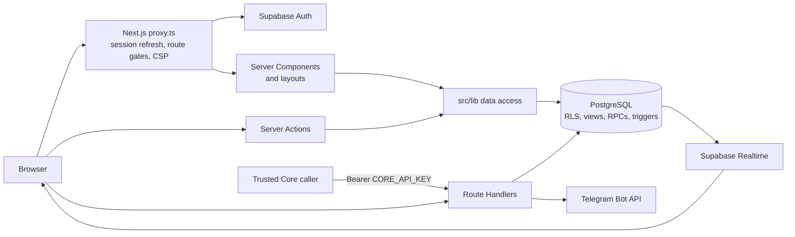

# Architecture

## System shape

QAIRU HUB is a single Next.js App Router application. Next.js renders server components and Route Handlers; client components provide interactive filtering, dialogs, optimistic controls, Supabase Realtime subscriptions, theme state, and demo state. Supabase supplies authentication and the live database boundary. A separate server-to-server Core API uses a privileged Supabase client behind its own Bearer key.



## App Router structure

| Path | Responsibility |
| --- | --- |
| `src/app/layout.tsx` | Forced-dynamic root layout, metadata, fonts, providers, and Vercel Speed Insights. It reads the CSP nonce forwarded by Proxy. |
| `src/app/(auth)/` | Authentication presentation layout and email/password forms. The route group is organizational and does not add a URL segment. |
| `src/app/(hub)/` | Authenticated/onboarded Hub pages sharing `AppShell`, current-user context, and live activity context. |
| `src/app/clubs/` | Separately laid out public club directory/details plus protected management pages. |
| `src/app/actions/` | Server Actions for profile, social, content, club, message, and notification mutations. |
| `src/app/api/` | Post comments GET, Core API, and Telegram webhook Route Handlers. |
| `src/app/auth/` | Supabase confirmation callback and password-recovery Route Handlers. |
| `src/proxy.ts` | Next.js 16 Proxy: CSP nonce, security response handling, Supabase claim validation/session refresh, verified internal headers, and live-mode route redirects. |

The installed Next.js 16.3 documentation in `node_modules/next/dist/docs/` confirms the repository's `src/app`, route group, async `params`/`searchParams`, Route Handler, and `src/proxy.ts` conventions.

## Server and client component split

Pages and layouts are server components unless marked otherwise. They authenticate, query Supabase through the data layer, and pass serializable models to interactive children. Examples include `/people`, `/projects`, `/events`, `/messages`, and `/clubs`.

Client components are marked with `"use client"` and handle:

- directory and Team Finder filtering;
- creation/application/attendance/save dialogs and button state;
- auth and onboarding forms;
- the shared navigation, command palette, theme, and toasts;
- message and notification Realtime channels;
- optimistic likes, saves, and read-state updates;
- demo-mode state in `localStorage`.

Server-only modules such as `src/lib/auth/current-user.ts`, `src/lib/supabase/server.ts`, `src/lib/core-api/*`, and Telegram API code import `server-only` where appropriate.

## Shared shell and navigation

`src/components/layout/app-shell.tsx` renders the desktop sidebar, mobile sheet, account menu, command search, and page slot. `src/components/layout/nav-items.tsx` is the canonical product navigation list. In live mode, `src/app/(hub)/layout.tsx` wraps protected content with:

1. a cached authenticated current-user summary;
2. an onboarding-completion redirect;
3. `CurrentUserProvider` for profile context;
4. `LiveActivityProvider` for unread message/notification counts;
5. `AppShell`.

The club tree reuses `AppShell` but permits anonymous access to browse routes. Suspense boundaries and `loading.tsx` files provide shell-first loading states. Detailed navigation timing notes remain in `docs/architecture/navigation-performance.md`.

## Authentication request path

In live mode, `src/proxy.ts` calls the Supabase SSR client's `auth.getClaims()`, refreshes cookies when needed, removes any client-supplied internal identity headers, and forwards validated user ID/email headers downstream. `src/lib/auth/current-user.ts` reuses those headers within the request or falls back to `getClaims()` when invoked without Proxy context.

Proxy is an early route gate, not the final authorization boundary. Pages, Server Actions, Route Handlers, RLS policies, RPCs, constraints, and triggers repeat the checks appropriate to their operation.

## Supabase clients

| Client | File | Credential and use |
| --- | --- | --- |
| Browser singleton | `src/lib/supabase/client.ts` | Public URL + publishable key; user session cookies; interactive reads and Realtime. |
| Server request client | `src/lib/supabase/server.ts` | Public URL + publishable key; SSR cookies; server components/actions/handlers. |
| Proxy client | `src/lib/supabase/proxy.ts` | Public URL + publishable key; claim validation and cookie refresh. |
| Anonymous server client | `src/lib/supabase/anonymous-server.ts` | Public URL + publishable key; stateless `public_clubs` reads. |
| Core API client | `src/lib/core-api/client.ts` | Server-only Supabase secret key, with service-role fallback; bypasses RLS and is isolated behind Core API validation/authentication. |

## Data access and mutation patterns

- Domain reads and typed mapping live under `src/lib/data/` and `src/lib/clubs/data.ts`.
- Server Actions in `src/app/actions/` validate and normalize input, require authentication/onboarding, call the data layer, translate safe errors, and revalidate affected paths.
- Transactional multi-row operations use PostgreSQL RPCs: onboarding, profile save, project creation, direct conversation creation, message send/read state, and club create/update.
- Database RLS, column grants, constraints, and triggers are the final boundary for ordinary authenticated Data API calls.
- Query results are deliberately bounded (typically 50–200 rows depending on the feature). Directory filtering is therefore client-side over the fetched window, not database-wide search.

## API boundaries

- `src/app/api/core/**` exposes four server-to-server resources with Bearer authentication, payload/query allowlists, 64 KiB bodies, explicit response projections, and privileged Supabase access.
- `src/app/api/telegram/webhook/route.ts` validates Telegram's secret header, enforces a 128 KiB body limit and a per-process chat quota, resolves an active club through the public view, and calls Telegram `sendMessage`.
- `src/app/api/posts/[postId]/comments/route.ts` is an authenticated, onboarded, no-store GET endpoint.
- `src/app/auth/*` handles Supabase PKCE confirmation/recovery exchange and protected password changes.

## Runtime and rendering decisions

- The root layout is `force-dynamic` so each response can carry a fresh nonce for Next.js framework scripts.
- Proxy constructs the CSP and appends server timing data. `next.config.ts` adds baseline security headers and production HSTS.
- No Edge runtime is selected. The Telegram webhook explicitly selects Node.js; the rest uses the Next.js default Node.js runtime.
- `vercel.json` requests `syd1`, matching the repository's documented Supabase `ap-southeast-2` deployment region. The hosted region itself was not re-queried during this documentation pass.

## Folder tree

```text
src/
├── app/                    routes, layouts, Server Actions, Route Handlers
├── components/             feature components and UI primitives
├── lib/
│   ├── auth/               current-user and auth-flow helpers
│   ├── clubs/              club validation/parsing/data access
│   ├── core-api/           internal API auth, validation, handlers, data
│   ├── data/               live domain queries and demo fixtures
│   ├── demo/               localStorage demo state
│   ├── security/           redirect and trusted-origin validation
│   ├── supabase/           browser/server/proxy/anonymous clients
│   ├── team-finder/        pure filtering and opportunity state derivation
│   └── telegram/           bot, validation, HTTP client, webhook security
└── types/                  application and generated Supabase types

supabase/
├── migrations/             canonical forward-only schema history
├── tests/database/         transactional pgTAP tests
├── seed.sql                local reference data and fixtures
└── config.toml             local Supabase services and Auth settings
```
